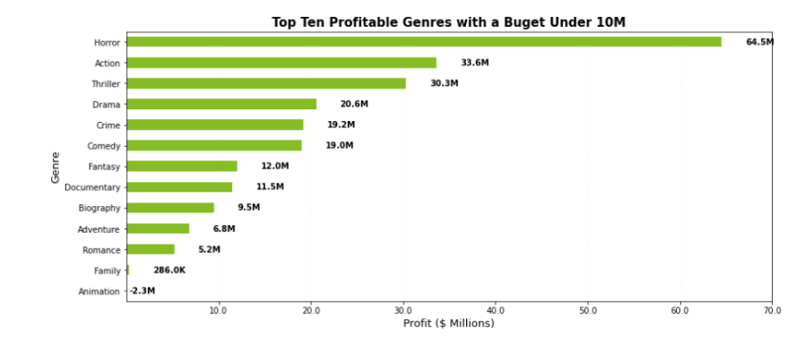

# Ai Academy Capstone Group 4
Presented by Brian Gorbea, Kelvin Cupay, Robert Cofer, Rob Masters, Ryan Lazar

## Overview
Using Explanatory data analysis(EDA) and statistical methods we are going to advice Computing Vision how the best way to jump start their new movie studio, called 'Computing Vision Entertainment'. We used sqlite3 in pandas to query the datasets given and hypothesis testing to evaluate our findings. Essentially, we are generating insights for their business and stake holders by making a two part suggestion, one is the early stage of the movie studio and scalability after several years.

## Business Understanding: 

Goals: The business question we are going to answer
Assumption : The parent company 'Computing Vision' does not have much backgrounk in creating movies.
1. Best investment in order to quick start the revenue of new movie studio 'Computing Vidion Entertainment'
2. Best investment in order to scale the business and future ventures in the business industry

This notebook will drive deeper into how we utilize the data sets to create meaningful visualizations and aggregrations in order to achieve our goals listed above.

We will also create hypothesis test to evaluate our findings and reccomendations which are based in scietific & mathematical reasonings. The reccomendation for the *head of Computing Vision's new movie studio* and help him decide which films to create the best film in terms of profits and appreciation.

### Real World Application(real-world problem): Today less people are going to the theatres and watching movies. Maybe Hollywood has gone stale and have stagnanted with their ways of creating movies, maybe through insights of what is most profitable for a new and small scale movie studio someone can use this information to create and start their new movie business.REVISIT)

## Stakeholders:(REVISIT CHECK WITH ROB)
- `Investors`: Can identify by profits if rate on investment(ROI) is significant for them to invest in Computing Vision Entertainment
- `Computing Vision(Parent Company)`: Is it worth it to make 
- `Critics`: Is this new movie studio just for profits or they actually want to create movies that are well liked
- `Fans`: Do we like the movies from this mobie studio
- `Potential future fans`: Repuation of this new in coming movie studio
- `Competing fans`: How well will this Computing Vision Entertainment handle the competing movie studios

# Middle : Methodology (START)
* Data Understanding
    
* Data Analysis
    * 3 visualizations
* Statistical Inference

* Rationale
    * For example, why are you using hypothesis testing rather than just a graph?
    * What about the problem or data is suitable for this form of analysis?
    * For a data science audience, this includes your reasoning for the changes you applied and choices you made while building confidence intervals and/or hypothesis tests.

## Data Undertanding: 
The data set comes from several sources where some are compressed into CSV(comma-separated values) or TSV(tab-separated values). The data sets listed below are from these respectable sources: [Box Office Mojo](https://www.boxofficemojo.com/), [IMDB](https://www.imdb.com/), [Rotten Tomatoes](https://www.rottentomatoes.com/), [The MovieDB](https://www.themoviedb.org/), [The Numbers](https://www.the-numbers.com/).

Here is a list of the data sets use:
- `bom.movie_gross.csv.gz`: each record is a movie with a title(object), domestic_gross(object), foreign_gross(float), and year released(int)
- `im.db.zip`: 
- `rt.movie_info.tsv.gz`:
- `rt.reviews.tsv.gz`:
- `tmdb.movies.csv.gz`:
- `tn.movie_budgets.csv.gz:`

# Data Prep
Task: Exploring what types of films are current doing the best at the box office using different samples of available data(we are looking at profitability).

# Data Pulling and Cleaning
Data is pulled from the csv, tsv and database files. Data is columns are renaimed to match each other. Budget and gross data is turned into a readable value by the program to create a new column called profit for each entry.

# Data Organizing, Data Merging, Data Formatting, Data Calculation

Change the column "title in the bom.movie dataframe. This will then allow us to merge both dataframes on that column.

After the column name was changed we can now merge and begin our data exploration.

Before we can work with the numbers in the columns we have to remove the $ and any spaces that may exist.

Now we create a profit column in the dataframe and we calculate that by subtracting the "production_budget" column from the "worldwide_gross" column. It is a large number so we then divide by 1,000,000 to change it out of scientific notation.

## 1st Visualization
This graph shows the top 10 studios that have the highest profit on average. It was created by combing the two dataframes movie_gross_df and movie_budgets_df, calculating profit, and then grouping by the studio. The values are the average profit (mean).

# Creating New Columns Continued
The genre data from the database has more than one genre per movie stored. The solution was to seperate the genres and pull the first genre that appears and mark that as the primary genre.

# Sorting data
The data is being sorted by most profitable to least profitable. One it has been sorted the data grabs the top 10 results from the list. The top ten list is then used for vizualiation later for top ten profitable movies.

# Creating Data
Data is being merged and calculated to represent the average based on the primary genre of a movie.

# 2nd Vizualization - Top Ten Profitable Movies with a Buget Under 10M
The vizualization is used to get the average profit based on genre while mantaining a budget under 10M.

The data is merged on movie names then sorted to only include production budgets under 10m. Once the data has been sorted the mean value for the primary genre is calculated and is sorted based on the total profit. What this produces is a dataframe with two columns. The first column is the name of the genre and the second column is the averaged profit that genre made in the past 50 years while also maintaing a budget under 10m.

## 3rd Vizualization - Top Average Profits by Genre
The vizualization is used to get the average profit based on genre. This data can represent which genres don't do well and what to potentially avoid. Such as making a Western movie may not produce results.

## Data Analysis(start)
Clean out the new dataframe gross budgets to modify the worldwide_gross and production budget values to ensure we can calculate profit. This starts by removing '$' and ',' from the cells and then converting the data into float.

Clean the data again just for the frequency analysis. Since we dont need studio information, it is better that we use just the movie_budgets_df dataframe as we get better quality data in regards to profits as there isn't data lost from the merge.

Calculate profits and change the vaules of profit and production budget to be represented in the millions. This is just for the movie budget dataframe.

 Analysis on profit

General analysis about profits. We use this dataframe because it has better data quality.

count    5782.000000
mean       59.899704
std       146.088881
min      -200.237650
25%        -2.189071
50%         8.550286
75%        60.968502
max      2351.345279
Name: profit, dtype: float64

## Creating histogram for profit

Below we create a histogram for profit. This provides us with a general anaysis of where profit lines up for all films, generally showing us the types of returns we can expect.

## Null Hypothesis:
Typically there is no relationship between A and B. In our case, profit has no relationship to any of the top 3 occuring studios.

## Alternative Hypothesis:
The alternative hypothesis is traditionally thought of when creating a hypothesis for an experiment. In our case, profit has a relationship to all or some of the top 3 occuring studios.

## General anaylsis for developing hypothesis testing
Here we check for all unique studios in order to get an idea of all the potential studios to emulate.

Check to see the total count of each studio. We are focusing on high studio frequency in the dataset to get an accurate pvalue test, as studios like Trib or FCW will not provide us with accurate results.

## Hypothesis testing
In this code we run a loop to check 3 different top occuring studios independently to see if they are significant to profit. We create a place to store the studios, and then create the loop which counts studios, sorts them by an occurrence count in decending order and then grabs the top 3 to do a p-value test independently of each other for studio and profit. One other condition we check for is if there is a null value for studio and drop it from the results.

Top 3 studio occurances in the dataset significance with profit:
Uni.: 3.688020261558896e-10
Fox: 9.610055205557015e-17
WB: 4.328957530102738e-10

## Rejecting the null hypothesis: 
Based on the results of each of the three studios being significant at the 95% threshold, we reject the null and accept the alternative that any of the top 3 occuring studios will help with profit.

## Confidence Intervals
Here in the code below we check the confidence interval for profit for films with a production budget under 10 million dollars.
The 95.0% confidence interval for movie budgets under 10 million represented in millions is: (15.59, 26.02)

Do the same thing as above but for films with a production budget over 10 million dollars.
The 95.0% confidence interval for movie budgets under 10 million represented in millions is: (115.68, 142.52)
 # Middle : Methodology
* Data Understanding
    
* Data Analysis
    * 3 visualizations
* Statistical Inference

* Rationale
    * For example, why are you using hypothesis testing rather than just a graph?
    * What about the problem or data is suitable for this form of analysis?
    * For a data science audience, this includes your reasoning for the changes you applied and choices you made while building confidence intervals and/or hypothesis tests.
 
 
 # End
* Recommendations
    * 3 reccs
* Next Steps
* Thank You
* This slide should include a prompt for questions as well as your contact information (name and LinkedIn profile)

# End of Note book

# Grading
* Attention to Detail (20%)
* Data Communication (20%)
* Authoring Jupyter Notebooks (20%)
* Data Manipulation and Analysis with pandas (20%)
* Statistical Communication (20%)
